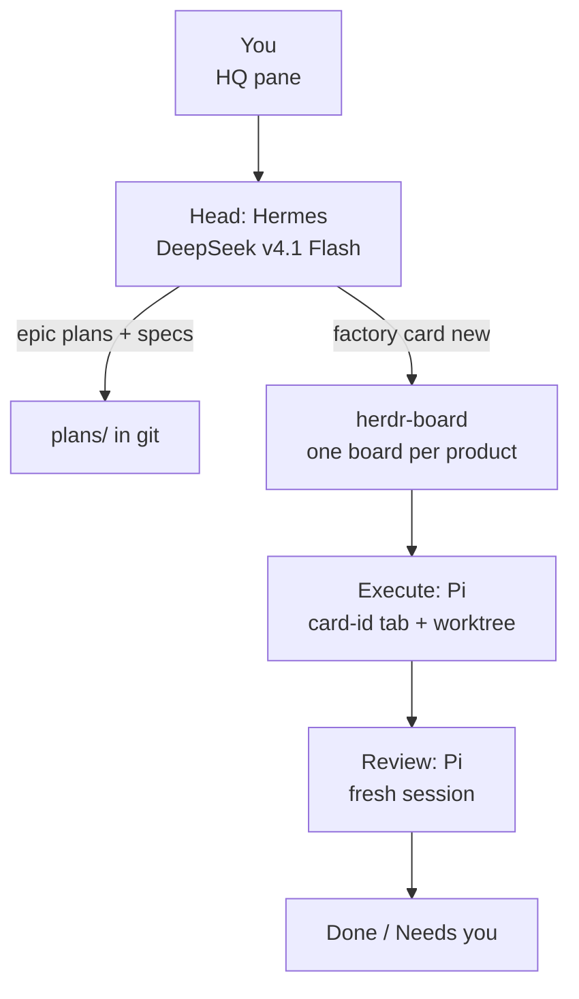

# Factory agent operating plan

Status: **approved 2026-09-26. Rollout steps 1–4 done 2026-09-28 (step 4 except items waiting on you, see Your setup checklist); step 5 done 2026-09-28: ClipHuman onboarded as product #1 (PR #1 merged: `AGENTS.md` distilled from `CLAUDE.md` and `docs/memory/`, `main` + `production` branches, guard-only protection since the repo stays private, board and critic installed, server deploys stay with you until the Todo deploy script exists); step 6 done 2026-09-28: `factory product new` tested end to end on a throwaway repo. Step 7 in progress (2026-09-29): skills reviewed and synced, personal brand onboarded as product `personal`, brand v1 awaiting your merge; see the Rollout table.** Review copy:
https://claude.ai/code/artifact/724d764b-d891-4523-a0b8-da17bf091f91

Hermes becomes the head agent on DeepSeek v4.1 Flash, herdr-board runs execution, Pi or Hermes does each task in visible Herdr panes you can step into, and you approve plans, posts and deploys.

## Decisions already made

These came from our Q&A and are treated as fixed unless you change them.

| Topic | Decision |
| --- | --- |
| Purpose | Multi-project factory that builds and markets software. Social Warrior (ClipHuman) is product #1 and the first goal after setup; the factory takes over its development and marketing, with deploys still gated by you. Your personal brand is its own project. Every project follows the same pattern: its own repo, board, accounts and brand file, served by the same roles. |
| Head agent | Must not depend on Claude (subscription ends around Oct 2). |
| Models | Via OpenRouter. DeepSeek v4.1 Flash for the head and the Hermes roles; DeepSeek V4 Flash (`deepseek/deepseek-v4-flash`) for the Pi workers (your "Mix" choice, 2026-09-26). Free models for very simple tasks; the critic uses GLM 5.3 Flash, a different model family of equal intelligence (chosen 2026-09-28). Budget: OpenRouter $20/month total, $7 per profile; X minimum credits; DataForSEO only on request. |
| Your interface | Terminal only, in a Herdr pane. |
| Approvals (until you say otherwise) | Plans, public posts, deploys to live servers. |
| Merging | Every merge needs an independent reviewer: code through the Review column, everything else (plans, goals, research, content, batches, strategy, brand, analytics) through the Docs review column. Nobody merges their own work. Uses your GitHub account plus a required status check. Agents never deploy unless told. |
| Concurrency | No fixed cap. React when box resources get critical. |
| Machine | This LXC container `agent-box` on the Proxmox host (5 cores, 12 GB RAM, no Docker) is dedicated. Workers run yolo inside worktrees. |
| Secrets | `.env` per project, gitignored. |
| Repos | `~/Projects/<product>` ↔ `github.com/en3r0/<product>`, one repo per product. The ops repo is named `factory` and is public (changed 2026-09-28 so GitHub enforces its rules); ClipHuman and `personal` (your personal brand, onboarded 2026-09-29) stay private; the test repos `factory-sandbox` and `factory-test` are retired. |
| Marketing | All of it, for products and your personal brand. Skills chosen from a six-repo audit; roles that improve by remembering get their own Hermes profile. Every skill file was read before it reached a profile (2026-09-29), and `AGENTS.md` says skills are reference, not permission: no installs, account sign-ups, paid APIs, scraping, guessed emails or outside sends without your approval on the card. |
| Visibility | Every agent must be visible in Herdr and easy to step into (hence Option D, herdr-board). |

## Core architecture

Hermes is the head and planner. [herdr-board](https://github.com/nelsonPires5/herdr-board) runs execution: every card's agent (Pi or Hermes, per column) starts in a visible Herdr pane you can watch or step into.

Each product has one board with the same 15 columns, defined in `columns/boards.toml`. Each auto column has its own prompt file and success/fail routing.

| Column | Trigger | What runs | On success | On fail |
| --- | --- | --- | --- | --- |
| Backlog | manual | Nothing. Engineering cards wait until `factory tick` dispatches them (epic approved, dependencies Done); marketing cards wait until the strategist releases them. | — | — |
| Execute | auto | Pi with the task spec. Merges `main` in, writes `WORKPLAN.md`, implements, opens a PR. | Review | Needs you |
| Review | auto, fresh session | Pi with the reviewer prompt. Checks the diff against the spec, requires green CI, merges on pass. | Done | Execute. Fixed at most twice; after a third failed review, Execute forwards the card to Needs you. Reviewer escalations also pass through Execute to Needs you. |
| Research | auto | The project's researcher (Hermes). Answers one question with sources, into `marketing/research/`, and opens its PR. | Docs review | Needs you |
| SEO | auto | The project's SEO role (Hermes). Runs an audit with the `seo` CLI, ranks fixes and content ideas, and opens its PR. | Docs review | Needs you |
| Draft | auto | The role the card names: content creator, community, or the general worker. Writes one piece or reply batch from a brief. | Edit | Needs you |
| Video | auto | The general marketing worker. Turns a brief into a short-video package (hooks, script, captions, optional render). | Edit | Needs you |
| Edit | auto, fresh session | The general marketing worker. Checks truth, brief, voice (humanizer) and channel fit. | Approve | Draft. After a third failed edit, Draft forwards the card to Needs you. |
| Outreach | auto | The project's outreach & PR role (Hermes). Builds one batch of personal messages. Blocked until cold-email compliance is set up. | Approve | Needs you |
| Docs review | auto, fresh session | Pi with the docs-review prompt. The independent check on every non-code PR: allowed paths only, required approvals present, no secrets, CI green. Merges on pass. Cards arrive from Research and SEO, from the head and marketing roles via `factory card new --review`, and from Publish after an item is posted or sent. | Done | Needs you |
| Approve | manual | You. Approve: move to Publish. Reject: comment why and move back to Draft. | — | — |
| Publish | manual | No agent. The publishing script posts cards here at their scheduled time, then moves them to Docs review to merge what went out. You post by hand (and move the card) until the factory's Postiz instance exists. | — | — |
| Deploy | auto, entered only by you | Pi with the deploy prompt. Runs an approved deploy request exactly as written; stops and hands you rollback commands on any failure. | Done | Needs you |
| Needs you | manual | Parking for failures, escalations and questions. Agents never move cards out of it. | — | — |
| Done | manual | — | — | — |

A run that sits idle for 90 seconds without calling `board done` is parked as `awaiting`. That is your cue to jump into its pane.

### Why Hermes is the head

- It is already always-on (systemd gateway), model-agnostic, and has persistent memory and cron. Losing Claude changes one line of config.
- It runs in your HQ pane, so the head is as visible and interruptible as the workers.
- It plans; herdr-board executes. Hermes' own kanban dispatcher stays off (`kanban.dispatch_in_gateway: false`) so two queues never compete for work.

### Why not Hermes kanban workers (checked 2026-09-25)

The Hermes kanban dispatcher runs inside `hermes-gateway.service` (systemd, outside Herdr) and launches each worker as a detached background process (`start_new_session=True`, no TTY, output to a log file; `hermes_cli/kanban_db_dispatch.py:2676`). Herdr only sees agents in its own panes, so those workers would be invisible. herdr-board opens a pane per run instead.

### Source of truth: hybrid

- Git is the "why". Each product repo has `plans/` holding epic plans and task specs as markdown. That is what you approve, and it outlives any tool.
- The board is the "who/when". Each card links to its spec file. The board is never the only place a decision lives.

### herdr-board gaps and how we cover them

herdr-board does the hard part, visible Pi panes per card, but leaves five gaps. Each has a small, specific fix.

| Gap | Fix |
| --- | --- |
| No git worktrees: cards run in a workspace directory, so parallel cards in one repo collide. | A small `factory card new` wrapper runs `git worktree add` on branch `wt/<card>`, then `board card create --space-kind new-workspace --space-cwd <worktree>`. Hermes always uses the wrapper. |
| No CI gate on completion. | The Review prompt requires green `gh pr checks` before `board done --outcome ok`. Branch protection on `main` enforces it regardless. |
| Its default install compiles from source (a heavy Rust build). | Use the prebuilt, checksum-verified release download instead: it ships the complete plugin with the binary. Copy the CLI with its `install-cli.sh` and register the plugin with `herdr plugin link`, which runs no build. No Rust needed. |
| Only a static concurrency cap (`max_concurrent`, default 3). No live memory guard. | See Resources. |
| Young single-maintainer project (v0.18). | Pin the version (`--ref v0.18.0`) and upgrade deliberately. |

### Pi vs oh-my-pi

Recommend Pi (also herdr-board's default harness). In a DeepSeek V4 Flash benchmark, Pi passed 20/30 tasks to omp's 17/30. Its cost per success was about a quarter of omp's ($0.028 vs $0.103), and it was roughly 2× faster ([Composio](https://composio.dev/content/pi-vs-omp)). omp's 31+ tools add about 33% more context, and it shipped 500+ releases in 9 months, which is churn you don't want under unattended workers. omp's real advantage is hash-anchored edits, which help weaker models. If Pi's edits fail during the spike, revisit omp or add a hashline-style extension to Pi.

## Compensating for a Flash-class planner

With a fast, cheap model as the head, structure has to do the work that raw intelligence did at your job.

1. **Templates, not prose.** Epic plan, task spec, review report, marketing brief and deploy request each have required fields. A missing field means not ready.
2. **Three planning levels, as at work.**
   1. Epic plan (head): goal, non-goals, user-visible outcome, risks, task list with dependencies.
   2. Task spec (head): context files, testable acceptance criteria, out-of-scope, size, verification commands. Written before approval, so you approve the epic and every spec together; nothing reaches `main` unseen.
   3. Micro-plan (worker): before touching code, the worker writes `WORKPLAN.md` in its worktree. The reviewer checks the diff against it.
3. **Critic pass on every plan.** A separate `critic` profile, running a different model family of equal intelligence and an adversarial prompt, reviews the epic and all its specs and must find gaps before the plan reaches you. A different model has different blind spots, so it catches mistakes the planner can't see in its own work.
4. **Definition of Ready.** Spec file follows the template, acceptance criteria are commands or observable checks, 5 files or fewer and 2 hours or less, out of scope written down (checked when the spec is written); every dependency is Done and the epic is approved (checked by `factory tick` at dispatch). The full list is in `AGENTS.md`.
5. **Definition of Done.** CI green, reviewer approved, acceptance criteria re-run with evidence pasted, PR merged by the Review column.
6. **Small tasks are the biggest lever.** Flash is reliable on a well-specified 1-hour task and unreliable on a vague 1-day one. When in doubt, decompose again.
7. **Escalation is a feature.** Workers comment and finish with `board done --outcome fail` rather than guess. Failures land in Needs you (a failure in Review or Edit passes back through Execute or Draft first), and the head surfaces them to you.
8. **Per-card model override.** Bump a rare hard card to a stronger OpenRouter model instead of upgrading everything. The head asks you first, with the reason and the model; it never raises spend on its own.

## Roster

A role gets its own Hermes profile only when its work improves by remembering. Each profile has its own memory and session history. Everything else goes to one general marketing worker that loads skills per card. The agent (Hermes or Pi) is chosen per task; the defaults below get verified in the spike. Marketing skills come from the audit in `research/marketing-skills-audit.md`.

Three rules follow from how Hermes memory works:

- **Durable knowledge lives in git files.** Built-in memory is about 2,200 characters of notes per profile, so it holds lessons, not facts. Voice, positioning, contacts and performance live in `personal-brand.md`, `product-marketing.md`, `contacts.csv` and `performance-log.md`.
- **One card at a time per remembering role.** Two processes sharing a profile corrupt its memory. Parallelism comes from running different roles side by side, plus the general worker.
- **The general worker writes no memory**, so it can run many cards at once without polluting anyone's notes.
- **Separate memory per project.** Every project gets its own copy of each remembering role (e.g. `cliphuman-strategist`, `personal-strategist`), with its own memory, sessions and platform tokens. Each role is a template in the factory repo, installed with `hermes profile install` and refreshed with `hermes profile update`, which keeps user data. Improving a role updates every project's copy. The head is factory-wide; the critic is per project.

| Role | Remembers | Default agent | Key skills (source repo) | Your approval |
| --- | --- | --- | --- | --- |
| Head | Yes | Hermes, HQ pane | Routing, epic plans, task specs; `create-prd`, user/job stories (pm-skills) | Plans |
| Critic | Yes | Hermes | `strategy-red-team`, `pre-mortem` (pm-skills); attacks engineering and marketing plans; one per project; runs GLM 5.3 Flash (`z-ai/glm-5.3-flash`), a different model family of equal intelligence | — |
| Executor | No | Pi, Execute column | Code tasks, including SEO fixes and site pages | — |
| Reviewer | No | Pi, Review column | Diff vs spec; merges on green CI | — |
| Deployer | No | Pi, Deploy column | Runs an approved deploy request exactly as written; never rolls back on its own | Every deploy (only you move cards into Deploy) |
| Strategist (#1) | Yes | Hermes | Owns the posting schedule (what goes where, when; runs it with cron) and each `product-marketing.md`; `beachhead-segment`, `ideal-customer-profile`, `positioning-ideas`, `pricing-strategy` (pm-skills); `launch`, `marketing-loops` (marketingskills) | Plans |
| Brand & voice (#2) | Yes | Hermes | Owns each project's brand and voice file (`personal-brand.md` for your personal project, with your voice sample, built from the interview plus your existing posts, emails and other writing; the editor checks every draft against it. No AI labels, so matching your style is critical); `content-strategy` pillars (marketingskills); `personal-strategic-signal-intelligence` (ai-marketing) | Brand changes |
| Researcher (#3) | Yes | Hermes (web, browser) | `customer-research`, `competitor-profiling` (marketingskills); `market-sizing`, `competitive-battlecard` (pm-skills); built-in `competitor-news-monitor` | — |
| Analyst (#4) | Yes | Hermes, scheduled | Owns `performance-log.md`; `analytics`, `ab-testing` (marketingskills); iannuttall `monthly-report`; `growth-engine` (ai-marketing) once there is traffic | — |
| Content creator (#5) | Yes | Hermes | `social`, `copywriting` (marketingskills); `x-longform-post`, `shortform-idea-grill` (ai-marketing; `content-ops` left out); formats for X, LinkedIn, short video, blog, newsletter | Via Approve |
| Community (#9) | Yes | Hermes (built-in `xurl` etc.) | `social` listening, `community-marketing` (marketingskills); drafts replies in batches | Every batch |
| Outreach & PR (#10) | Yes | Hermes (built-in `himalaya` email) | Owns `contacts.csv`; `prospecting`, `cold-email`, `public-relations` (marketingskills) | Every batch |
| SEO & site (#11) | Yes | Hermes, scheduled | iannuttall `seo` CLI (audit, `top-fixes`, `ai-readiness`, `llms.txt`, `quick-wins`, `decaying-pages`, `technical-watch`); `ai-seo`, `schema` (marketingskills). Fixes become Execute cards | Deploys |
| General marketing worker | No | Hermes or Pi per card | Video: ClipHuman, `shortform-idea-grill`, `net-new-video-editor` (ai-marketing), `video` (marketingskills). Editing: regex lint + `humanizer`, `copy-editing`. Launches: `launch` (`directory-submissions` dropped 2026-09-29: mostly mass account creation). Anything else ad hoc | Via Approve |
| Publishing (#8) | — | Script, not an agent | Posts approved items at the strategist's scheduled time through the factory's own Postiz instance (official platform APIs), and sends approved emails | Already approved |

**Planned, not active: affiliate websites.** A future product type. It would draw on Affitor's research, content and landing-page skills after cleanup: remove the "Powered by Affitor" footer and UTM tags, drop `reddit-post-writer`'s disguised-promotion pattern, and add FTC disclosure via `compliance-checker`.

## Approval gates

Gates are either manual columns that only you move cards out of, or columns only you may move cards into. Loosening one later means changing that column's trigger or the move guard.

- **Plan gate.** You approve each epic and its specs together in chat. Only then does the head get the plan merged (through Docs review) and create the task cards in Backlog. `factory tick`, not the head, moves each card to Execute once its epic is approved and its dependencies are Done.
- **Post gate.** Marketing content runs Draft (content creator or general worker), then Edit, then Approve (manual), then Publish. Nothing is published until you move the card.
- **Reply gate.** Community drafts replies in batches a few times a day and stops in Approve. You approve the batch; the publishing script posts it.
- **Outreach gate.** Outreach cards produce a batch file of recipients and messages, then stop in Approve. Only your move releases the batch to the send script. No cold email is sent until the compliance questions (postal address, daily cap) are answered; the head asks you when outreach is first needed.
- **Deploy gate.** Deploy runs automatically, but only you can move a card into it. The head also asks your yes to the exact deploy and rollback steps before the deploy request is merged.
- **Who may move cards.** Agents never move cards into Execute, Approve, Publish or Deploy, and never move a card out of Needs you. Only you, `factory tick` (into Execute) and the publishing script (Publish to Docs review) do. The role prompts say so, and a move-guard hook on the `board` CLI enforces it.

## Herdr layout

One HQ workspace for you and the head, plus one workspace per product where workers appear as panes named after their card.

- **HQ workspace:** head chat in one tab, the board in another. Open the board by running `board tui` in a shell tab (it stays open and updates live; `q` quits), or as an overlay with `herdr plugin action invoke open-board --plugin herdr-board`.
- **No keyboard shortcuts.** You run Herdr on your own computer and connect to this box over SSH, so key bindings are read by your local Herdr, not this box's. We tried and dropped them.
- **Product workspaces:** herdr-board opens one stable `card-<id>` tab per card, running that column's agent (Pi or Hermes) in the card's worktree. Jump from the board with `o` on a run, or step in directly.
- **Use `herdr notification`** for "needs you" pings, since you're terminal-only.
- **Done in step 1:** Herdr updated to 0.9.1, Pi and Hermes integrations installed, herdr-board 0.18.0 linked from its prebuilt release.

Ideas worth borrowing from [awesome-herdr](https://github.com/yigitkonur/awesome-herdr), not necessarily their code:

| Project | Idea for us |
| --- | --- |
| [herdr-portal](https://github.com/loofare/herdr-portal) | A board of every agent in every workspace. Its default opening is a key binding, which doesn't work in your setup; revisit only if it can be opened by command. |
| [hermes-herdr-auto-reconcile](https://github.com/chris-yyau/hermes-herdr-auto-reconcile) | Reviewed and not used: it requires a messaging-gateway session, and you're terminal-only. |
| [herdr-triage](https://github.com/natori-hrj/herdr-triage) / [herdr-island](https://github.com/kay-ws/herdr-island) | Surface only blocked or stalled workers. |
| [herdr-standup](https://github.com/natori-hrj/herdr-standup) | Daily summary of work across workspaces. |
| [herdr-dagr](https://github.com/aemrebarut/herdr-dagr) | Live task-graph view in a split. |
| [herdr-cadence](https://github.com/zhenyufu/herdr-cadence) | A lead agent gives each worker only the context it needs. |

## Resources: no cap, with a brake

herdr-board only has a static `max_concurrent` cap (default 3) and no live memory guard, so we set the cap high and add our own brake.

1. **High cap as a backstop only.** Set `max_concurrent` well above normal load (e.g. 12), so in practice there is no limit.
2. **Governor script.** Every minute it checks available memory and load. Under pressure it creates `~/.local/state/factory/hold`, which makes `factory tick` stop dispatching new cards, and writes a line to `~/.local/state/factory/alerts.log`, which the head reports to you. When critical, it lowers `max_concurrent` and restarts the board daemon. The spike must confirm a daemon restart leaves running panes alone.
3. **systemd slice for the Herdr server: skipped (decided 2026-09-28).** Herdr isn't started by systemd here, so a slice would change how you start Herdr. The governor and the no-heavy-builds rule cover it; revisit only if the box freezes again.
4. **Resize the container** when the governor fires often. 8 cores and 24 GB should comfortably hold 8–10 concurrent Pi workers.
5. **Offload heavy builds** to GitHub Actions CI or other boxes via Herdr `--machine`.

**Spend brake.** Each Hermes profile and the Pi workers get their own OpenRouter API key with a $7 monthly credit limit, and the account total is capped at $20. For scale: the Pi benchmark averaged about 560k tokens per coding task. At OpenRouter prices checked 2026-09-28, that is about $0.03 per task on either deepseek-v4.1-flash ($0.035 in / $0.29 out per million tokens) or deepseek-v4-flash ($0.021 / $0.32), assuming about 90% of tokens are input, so $20 covers several hundred tasks. The critic's GLM 5.3 Flash ($0.15 / $0.50) runs once per plan and costs fractions of a cent per critique. Keys use OpenRouter's per-key limit with a monthly reset; the $20 total is the prepaid credit you load each month. There is no automatic prioritization: the governor writes alerts at 50%, 80% and 100% of the monthly budget to `alerts.log`, the head reports each one to you once, and you decide.

## Git, merging, secrets and guardrails

Agents merging their own work is safe only because CI, branch protection and hooks enforce the rules, not the model.

- **One worktree per card**, created by `factory card new` on branch `wt/<card>`. Workers never touch the main checkout.
- **Branch protection on `main`:** require CI and the `factory/review` status, which only the Review and Docs review columns post. This is what makes agent merges safe: no agent merges or approves its own work. CI must run at least one check on every PR, including docs-only ones, and branches must not be required to be up to date with `main`. On GitHub's free plan these rules are only enforced on **public** repos (decided 2026-09-28: `factory` and `factory-sandbox` are public, and the sandbox was removed 2026-09-29 after testing; ClipHuman stays private, and how its merges are protected, GitHub Pro or a local guard, is decided at step 5, with nothing merged into it before then).
- **Yolo guardrails.** Pi and the Hermes column workers (`--yolo`, via `scripts/factory-hermes-run`) run without approval prompts, so rules are enforced outside the model: `scripts/factory-guard` stands in for `git`, `gh`, `board`, `ssh`, `scp`, `sftp` and `rsync` (first on `PATH`) and, for agents only, blocks force pushes, pushes to `main`, `--no-verify`, `--admin`/`--auto`, merges and status posts outside Review/Docs review, forbidden card moves, and remote connections outside Deploy; every block is logged to `~/.local/state/factory/guard.log`. Your own commands pass through. Each product repo also uses `githooks/pre-commit`, which blocks `.env` files and runs `gitleaks`. Server-side branch rules remain the primary protection.
- **Learned skills.** Hermes roles may teach themselves skills. Once a month the head lists them (`skills list --source local`) and you decide, per skill, to promote it into the role template or delete it.
- **Services.** The board daemon, `factory tick` and the governor run as systemd user services from `config/systemd/`. They need linger enabled (`sudo loginctl enable-linger en3r0`) to keep running when you're logged out and to start after a reboot.
- **Proxmox snapshot** before enabling unattended runs, then nightly. That is the undo button for the whole box.
- **Secrets:** `.env` per product plus a committed `.env.example`. The OpenRouter key lives in `~/.hermes/.env` and Pi's config, never in product repos.
- **No heavy builds on this box.** The host went down on 2026-09-26 during setup, and rebooting it costs you time. Tools are installed from prebuilt, checksum-verified releases whenever one exists. Anything that must compile runs in GitHub Actions or on another machine, and large local builds need your OK first.
- **Portable project memory:** every repo gets an `AGENTS.md`, which Pi, Hermes and most agents read. Distill Social Warrior's `CLAUDE.md` and `docs/memory/` into it this week, while Claude can still do it well.

## The factory ops repo

`~/Projects/factory` (to become `en3r0/factory`) holds the operating system itself, so Hermes can later improve it through PRs you approve.

| Path | Holds |
| --- | --- |
| `PLAN.md` | This plan. |
| `AGENTS.md` | How the factory works; read by every agent. |
| `roles/<role>/` | Role templates (SOUL, skills, config) for every Hermes role, installed per project with `hermes profile install` and refreshed with `hermes profile update`. |
| `columns/` | `boards.toml` (one board per product with every column: triggers, routing, harness, timeouts) plus one prompt file per auto column: Execute, Review, Deploy, Research, SEO, Draft, Video, Edit, Outreach, Docs review. |
| `templates/` | `epic.md`, `task.md`, `review.md`, `brief.md`, `deploy-request.md`. |
| `scripts/factory` | One command with subcommands: `factory card new` (worktree + card), `factory critic` (opens a project's critic on a plan in a visible pane), `factory tick` (the dispatcher, run every minute: moves ready engineering cards from Backlog to Execute, respects the hold file, notifies on new Needs-you cards; a plain script, no AI) and `factory product new` (repo, board, columns, role profiles, `AGENTS.md`, branch protection). |
| `products.txt` | The products the head manages, one repo path per line. `factory product new` adds to it. |
| `scripts/SPEC.md` | Required behavior of the factory scripts (card new, critic, tick, governor, move guard), derived from the prompts. Step 3 builds and tests against it. |
| `scripts/governor.sh` | The resource brake. |
| `hooks/` | Guardrail hooks, including the `board move` guard. |
| `config/` | Not created yet. Step 3 adds `herdr-board/config.toml` (harnesses, `max_concurrent`), symlinked into place. |

## Posting

Decided 2026-09-29: posting goes through a **new Postiz instance for the factory**, completely separate from ClipHuman's (own server, database, developer apps and accounts; nothing reused). This replaces the earlier plan to build a posting tool, to keep things simple. Posting uses official APIs only, never a logged-in browser: browser automation breaks the platforms' terms (LinkedIn restricts accounts for it), gives an agent full control of the account, and can't be limited to approved posts. Setting it up is on the Todo list; until then you post approved items by hand.

The platform permissions below still apply: each project's developer apps request only what posting needs.

| Platform | Permissions requested | Works without review? | Notes |
| --- | --- | --- | --- |
| LinkedIn | `w_member_social` via the self-serve Share product | Yes | Personal posting |
| Facebook / Instagram | Standard Access on your own Page and Instagram account | Yes | Instagram needs a Business/Creator account and media served from the project's own website |
| YouTube | `youtube.upload` only | To be confirmed in the spike | Goal: a Production app with no 7-day token expiry |
| TikTok | `user.info.basic`, `video.upload` | Yes | Posts land as drafts in the TikTok app until that project's app passes the audit |
| X | Pay-per-use API, about $0.015 per post | n/a | Minimum X credits only |
| Threads, Bluesky, Mastodon | Their standard posting APIs | Yes | Simple |

Each project connects its accounts once in Postiz (one Postiz workspace per project). Postiz holds and refreshes the tokens; agents only get a Postiz API key that schedules posts.

**Email.** There is no sending service. Outreach sends from `me@dustinmontgomery.net` over its own mail server, using Hermes' built-in `himalaya` email client, once the mailbox is confirmed working. $0.

## Your setup checklist

Things only you can do. The first list has no dependencies. The second waits for the factory's Postiz instance, which sets the callback URLs each developer app needs.

**Now**

- [x] Take a Proxmox snapshot of this VM (on the host). Done 2026-09-26.
- [ ] OpenRouter: account, an API key with a $20 monthly limit (2026-09-26) and $10 of credit (2026-09-28) are done. Still needed: a provisioning key so the factory can create per-profile keys with $7 monthly limits. Rotate the key you pasted in chat once per-profile keys exist.
- [x] GitHub: create a fine-grained token limited to the factory's repos (`factory`, `social-warrior`). Read/write: Contents, Pull requests, Issues, Commit statuses. Read: Actions, Metadata. Add Administration read/write only if agents should set branch protection; otherwise you set it per repo when asked. Done 2026-09-28; add each new product repo to it (plus Workflows read/write). `personal` added 2026-09-29.
- [ ] Delete the test repos `en3r0/factory-test` and `en3r0/factory-sandbox` on GitHub and remove both from the token. Optional: the empty `factory-sandbox` board project (#3) won't archive (`board project archive 3` fails with "No such file or directory"); it's harmless.
- [ ] Email: log in to me@dustinmontgomery.net, send and receive a test, and note its IMAP/SMTP settings plus an app password.
- [ ] X: developer account on the pay-per-use plan with the minimum credits.
- [ ] Google Search Console: verify cliphuman.com and dustinmontgomery.com (DNS TXT record in Cloudflare).
- [x] Voice training material: links to or exports of your posts (X, LinkedIn), a few emails, and anything else you've written that sounds like you. Done 2026-09-29: five published pieces and your X bio; short posts come in the second interview (Todo).
- [x] Book about an hour for the brand interview. First interview done 2026-09-29; the second is in Todo.
- [x] Enable linger so factory services survive logout and reboot: `sudo loginctl enable-linger en3r0`.
- [ ] Add the same `protect main` ruleset to `en3r0/factory` (public), once you're happy for all factory changes to go through PRs.

**Later, per project (ClipHuman first)**

- [ ] Meta developer app (Standard Access), a Facebook Page, and an Instagram Business or Creator account linked to it.
- [ ] LinkedIn developer app with the Share on LinkedIn product.
- [ ] Google Cloud project with the YouTube Data API and a consent screen requesting only `youtube.upload`.
- [ ] TikTok developer app with Login Kit and the Content Posting API (`user.info.basic`, `video.upload`); submit the audit when ready.
- [ ] An X app under your pay-per-use account.
- [ ] Threads, Bluesky and Mastodon accounts plus app passwords, for the platforms you want.
- [ ] A Google service account for the SEO tool's Search Console access.
- [ ] Confirm whether ClipHuman's existing brand social accounts connect to the factory's new apps. Your "take over" answer covered development.

## Rollout

Work that needs strong judgment goes first, while Claude is still available. The Flash head can do the mechanical work later.

| # | Step | Needs Claude? |
| --- | --- | --- |
| 1 | Housekeeping: `herdr update`, OpenRouter key, switch Hermes to DeepSeek v4.1 Flash and turn off its kanban dispatch, install Pi and `herdr integration install pi`, install herdr-board v0.18.0 from its prebuilt release (no compiling), Proxmox snapshot. | No |
| 2 | Write templates, column prompts, Hermes role prompts, DoR/DoD and the factory `AGENTS.md`. | Yes: their quality sets the quality of everything else |
| 3 | Build `factory card new` (worktree wrapper), `factory critic` and `factory tick` (the dispatcher), then run one tiny real card end to end: plan, critic, your approval, Execute, Review, PR merged. Confirm a daemon restart leaves running panes alone, Hermes runs as a visible herdr-board harness you can step into, and a remembering role can be limited to one run at a time. | Yes |
| 4 | Guardrail hooks, `board move` guard, governor, branch protection. | Partly |
| 5 | Distill Social Warrior's memory into `AGENTS.md` and onboard it as product #1. | Yes |
| 6 | `factory product new` bootstrap. Done 2026-09-28: you create the GitHub repo and add it to the token; the command (you or the head) does the rest and lists what is left for you. `factory tick` now also keeps the factory checkout and every board's column prompts current. | No |
| 7 | Install the chosen marketing skills (see `research/marketing-skills-audit.md`), interview you to write `personal-brand.md` and your voice sample, set up the marketing columns and the Google Search Console service account. In progress 2026-09-29: every copied skill file was read before syncing, then synced into each role and its profiles (`directory-submissions` dropped; new `AGENTS.md` rule: skills are reference, not permission; the `seo` CLI is installed); the marketing columns are on every board; your personal brand is product `personal` (private repo, board, profiles); the first brand interview is done and `personal-brand.md` v1 waits in personal PR #1 for your merge. Left: the second interview, the ClipHuman brand interview, the Search Console service account. | Partly: the voice sample and brand file benefit from Claude |
| 8 | Loosen gates as trust builds. | Ongoing |

## Todo

- [ ] **ClipHuman server deploys by agents.** Build and test `ops/deploy.sh <component> <sha>` in the ClipHuman repo: copy exactly the promoted commit (never `--delete`, never touching on-box secrets), `npm install` when needed, restart, health check, and a rollback path. Until then agents promote `production` (which deploys the site) and you deploy the servers from the steps in each deploy request. Priority after the beta launch (decided 2026-09-28).
- [ ] Per-profile OpenRouter keys ($7 cap each) once you create a provisioning key.
- [ ] Ruleset on `en3r0/factory` when all factory changes should go through PRs.
- [ ] **The factory's own Postiz instance** (decided 2026-09-29), separate from ClipHuman's. Open: where it runs (this box has no Docker and little RAM; another LXC on the Proxmox host is likely), its domain for OAuth callbacks, one workspace per project, and how the Publish column hands approved posts to it (Postiz public API key, schedule only). Then the per-project developer apps in the checklist.
- [ ] **Second brand interview (personal)**, after PR #1 on `en3r0/personal` merges: newsletter name and platform; what you're building now that's public; ClipHuman in your own words; a few short posts or replies (the short-form voice isn't captured yet). Answers go into `personal-brand.md`'s facts bank. Then the ClipHuman brand interview.

## Open questions (answered 2026-09-25)

| Question | Your answer |
| --- | --- |
| Ops repo name and visibility | `factory`, private. |
| OpenRouter budget alarm | $20.00/month total, $7.00 per profile. |
| Critic on another model family? | Yes, when there's a reason; later changed to: the critic **should** use a different model family of equal intelligence. Free models for very simple tasks. |
| Reviewer GitHub identity | Your account plus a required status check. (Later: the head was allowed to merge plan-only PRs; on 2026-09-28 you reversed that to follow the plan, so all non-code PRs go through the Docs review column.) |
| Proxmox snapshot before the spike | Yes. |
| No Deploy-column credentials to Social Warrior boxes until granted | Yes. |
| Outreach sending tool and domain | No sending tool. Use me@dustinmontgomery.net; confirm it works before use. |
| DataForSEO budget | A small budget will be considered by request. |
| Voice sample and `personal-brand.md` | You want an interview. |
| Personal site | dustinmontgomery.com. Ask you about a redesign. |
| X cap and Instagram media host | Minimum amount of X credits; the project's own website hosts media. |
| Personal brand as a separate factory project | Yes. |

### Follow-ups from your answers

- [ ] Talk with you about redesigning dustinmontgomery.com.
- [ ] Confirm me@dustinmontgomery.net can send and receive before any outreach.
- [x] Resolved: dustinmontgomery.net is separate from your site's domain (dustinmontgomery.com) and is OK for cold email, so outreach risk stays off the main domain.

### Open questions, round 2 (answered 2026-09-26)

| Question | Your answer |
| --- | --- |
| First real goal after the setup test | ClipHuman. |
| ClipHuman's scope | Take over, yes (development and marketing). |
| Budget priority when money runs short | Just alert me. |
| Check-in rhythm and phone pings | Nothing done outside the terminal for now. |
| Human-only setup | Give me the list; I'll work through it asap (see Your setup checklist). |
| GitHub access | Fine-grained token. |
| AI disclosure | No. You review and edit; be extra sure the voice is trained on your style. |
| Cold email compliance | Ask again when it's needed. |
| Claude's last week priorities | Ask if it comes down to that. |

## Sources

- [Composio: Pi vs OMP](https://composio.dev/content/pi-vs-omp)
- [oh-my-pi repository](https://github.com/can1357/oh-my-pi)
- [awesome-herdr](https://github.com/yigitkonur/awesome-herdr)
- Hermes kanban docs, local copy: `~/.hermes/hermes-agent/website/docs/user-guide/features/kanban.md`
- Herdr agent skill: `herdr --skill`
- [herdr-board (nelsonPires5)](https://github.com/nelsonPires5/herdr-board), including its configuration docs and agent skill
- [herdr-portal](https://github.com/loofare/herdr-portal)
- [hermes-herdr-auto-reconcile](https://github.com/chris-yyau/hermes-herdr-auto-reconcile), reviewed and not used: it requires a messaging-gateway session
